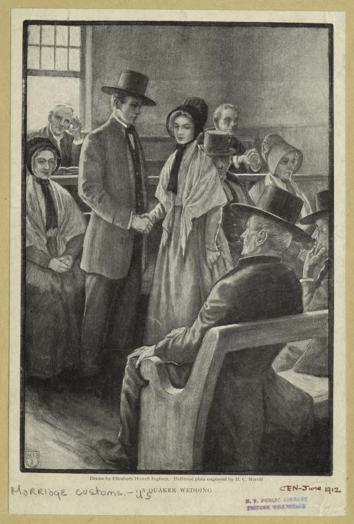

Hallo liebe Freunde und Freunde der Freunde!

Am Samstag, 27.7.2024 fällt die Quäker-Andacht aus, da diesmal der Samstag auf den Hochzeitstag von meiner Frau und mir fällt.

Die nächste Andacht, die wieder stattfindet, ist am Samstag, den 10.8.2024. Wie gehabt, um 17 Uhr, in der Königstraße 132 in 47798 Krefeld. Und wer möchte, dann ab 16 Uhr mit Tee-Trinken und Gesprächen über Glaubensfragen.

Thema ist dann Heiraten und Ehe aus Sicht der Quäker. Hier gibt es nämlich große Unterschiede zu anderen Konfessionen. Anlass ist nicht so sehr der erwähnte Hochzeitstag, sondern dass die Andacht am 24.8.2024 auch schon wieder ausfällt; zum Glück aus positiven Gründen, denn meine Frau und ich sind an dem Tag auf einer Quäker-Hochzeit eingeladen.

|                             |
|------------------------------|
| Quäker-Heirat 1912[^foot003] |

In den Anfängen des Quäkertums gab es keine bestimmten Regeln zur Heirat. Wie viele andere in der Zeit des [englischen Bürgerkriegs](https://de.wikipedia.org/wiki/Englischer_B%C3%BCrgerkrieg) glaubten auch viele Quäker zunächst, in einer Endzeit zu leben. Viele erwarten also das baldige Anbrechen des Reiches Gottes auf Erden. Das blieb aber bekanntlich aus. Nach einiger Zeit erkannten die Quäker für sich, dass sie mehr Struktur brauchten (da Gott offenbar nicht unmittelbar eingreift und die Dinge in der Welt ordnete). Das merkten sie auch zum Teil daran, dass die Eheschließungen nicht immer sehr glücklich verliefen und zum Teil problematisch waren. Zum Teil kam es auch zu Skandalen, und die Quäker fürchteten um ihren Ruf.

Für Quäker war und ist die Ehe kein Sakrament, wie für andere Konfessionen. Trotzdem wollten sie die Eheschließungen in geordnete Bahnen lenken. Nachdem 1675 die Monats- und Jahresversammlungen gegründet waren, gab es auch Gemeindeordnungen, die die Heirat regelten. Mitglieder wurden dazu angehalten, nur innerhalb der Glaubensgemeinschaft zu heiraten. War der Partner oder die Partnerin, nach der Heirat, ausgetreten und zu einer anderen Konfession konvertiert, war das kein Problem. Es war auch kein Problem, in das Quäkertum einzutreten, auch wenn der Partner oder die Partnerin nicht mit konvertierte.

Vor allem in Deutschland im 19. Jahrhundert waren die sehr strengen Regeln ein sehr großes Problem, da es nur sehr wenige Quäker im einem heiratsfähigen Alter gab. Das führte dazu, dass die Quäker-Gruppen immer wieder Mitglieder verloren, weil diese in die Nordamerikanischen Kolonien auswanderten oder Partner von anderen Konfessionen heirateten und dann ausgeschlossen wurden.

Heute ist das kein Thema mehr. Es gibt keine Regeln mehr, die es Quäkern verbietet, Nichtquäker oder -quäkerin zu heiraten. Wenn man bedenkt, wie lange dieses Regel noch Bestand hatte, ist es um so erstaunlicher, wie progressiv Quäker auf einmal mit gleichgeschlechtlichen Ehen umgegangen sind. So erkannten die Britischen Quäker gleichgeschlechtliche Ehen an, noch bevor sie 2013 legalisiert wurden. Dazu muss man wissen, das kirchliche Trauungen in Großbritannien rechtskräftig sind, ohne eine Amtshandlung. Das heißt, die Quäker gingen bewusst in Konfrontation zum Staat und vollzogen somit illegale Trauungen.

Das Zeremoniell einer Quäker-Hochzeit unterscheidet sich erheblich von anderen Konfessionen. Die patriarchale Tradition der Übergabe der Braut von Brautvater an den Bräutigam wird zum Beispiel nie gemacht. Bei dem liberalen und konservativen Flügel, mit unprogrammierter[^foot001] Andacht, bildet eine Andacht den Rahmen, zu der die Freunde zusammen kommen. Nach einer unbestimmten Zeit der Stille entscheidet das Brautpaar irgendwann aufzustehen und vor die Gemeinde zu treten. Das ist der Moment, in dem sich die beide ihr gegenseitige Beteuerung zusprechen, künftig füreinander dazu sein.

Es gibt keine Vorgaben oder Formeln, die zu sprechen sind. Es gibt keinen Priester oder Pfarrer, der eine Formel spricht oder den Segen spendet. Manche Jahresversammlungen geben Formulierungshilfen in ihren Gemeindeordnungen. So zum Beispiel das Ohio Yearly Meeting in seinem  [Book of Discipline](https://ohioyearlymeeting.org/documents/):

> In the presence of the Lord, and before these our Friends, I take thee, \______\_ to be my wife (husband), promising, with Divine assistance, to be unto thee a loving and faithful husband (wife) so long as we both shall live.

Deutsch:

> In der Gegenwart des Herrn und vor diesen unseren Freunden nehme ich dich, \______\_, zu meiner Frau und verspreche, dir mit göttlicher Hilfe ein liebevoller und treuer Ehemann zu sein, solange wir beide leben.

Danach setzt sich das Brautpaar und die Andacht wird fortgesetzt. Jetzt kann jeder das Wort ergreifen und sprechen. Es können zum Beispiel Segenswünsche formuliert werden. Frei und spontan oder abgelesen.

Nach der Andacht wird das Trauungszertifikat ausgelegt und alle Anwesenden können mit ihrer Unterschrift die Vermählung bezeugen. Hier spielt die Konfession keine Rolle. Auch schon im 17. Jahrhundert sind Unterschriften von Mennoniten auf den Trauungszertifikaten von Quäkern zu finden[^foot002]. Und das, obwohl sie nicht untereinander heirateten.

|                                                       |
|--------------------------------------------------------|
| Hier ist das Trauungszertifikat von meiner Frau und mir |

Nach der Andacht wird dann in der Regel noch gegessen und gefeiert. Früher ohne Musik und Tanz! Da heute viele Paare unter den Quäkern gemischtkonfessionell heiraten, wie ich selber auch, muss man offen und kreativ mit den jeweiligen Bedürfnissen bei den Abläufen umgehen.

Aber natürlich müssen die Gäste auch "abgeholt" werden, damit sie verstehen, was passieren wird und was ihre Rolle dabei ist. Bei unserer Trauung waren unter den Gästen Mennoniten, Protestanten, Katholiken, Zeugen Jehovas, Buddhisten, Atheisten und Agnostiker. Das Britain Yearly Meeting hat zur Aufklärung extra [Flyer](quaker-wedding.pdf) erstellt, um die Information der Gäste zu vereinfachen. In Großbritannien ist das unterschrieben Heiratsdokument ein voll rechtswirksames Dokument. Deshalb unterschreiben nur volljährige Personen und mit ihren vollen Namen. In Deutschland ist das nicht so, und unseren Gästen war das auch nicht bekannt. Deswegen sind auf unserem Zertifikat nur Vornamen zu lesen und zum Teil von Kindern. :-)

| <iframe width="560" height="315" src="https://www.youtube.com/embed/cmFuAr0aUHA?si=bP-wvxwY18Xn4Fvc" title="YouTube video player" frameborder="0" allow="accelerometer; autoplay; clipboard-write; encrypted-media; gyroscope; picture-in-picture; web-share" referrerpolicy="strict-origin-when-cross-origin" allowfullscreen></iframe> |
|------------------------------------------------------------------------------------------------------------------------------------------------------------------------------------------------------------------------------------------------------------------------------------------------------------------------------------------|
| Interviews mit Quäkern zum Thema Hochzeit                                                                                                                                                                                                                                                                                                |
---

This work is licensed under <a href="https://creativecommons.org/licenses/by/4.0/?ref=chooser-v1" target="_blank" rel="license noopener noreferrer" style="display:inline-block;">CC BY 4.0</a>

---

## Fussnoten

[^foot001]: Von "unprogrammiert" spricht man, wenn es keine Liturgie oder festen Ablauf mit Predigt und Gesang gibt.
[^foot002]: Siehe auch den Wikipedia-Artikel [Mennonitisch-quäkerische Ökumene](https://de.wikipedia.org/wiki/Mennonitisch-qu%C3%A4kerische_%C3%96kumene#Kooperationen)
[^foot003]: [Bild-Quelle](https://digitalcollections.nypl.org/items/510d47e2-d188-a3d9-e040-e00a18064a99) THE NEW YORK PUBLIC LIBRARY, DIGITAL COLLECTIONS, public domain materials