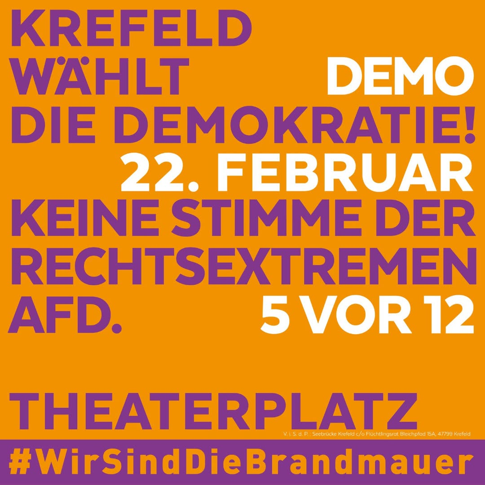

Hallo liebe Freunde und Freunde der Freunde!

Kommenden Samstag, den 25.01.2025 um 17 Uhr, findet in der Königstraße 132 in 47798 Krefeld die nächste Quäker-Andacht statt, zu der Ihr wieder herzlich eingeladen seid.

Wer möchte, kommt gerne schon um 16 Uhr, um sich mit der Bibel zu beschäftigen, Glaubensfragen zu diskutieren und/oder einfach nur Tee zu trinken.

**Noch der Hinweiss:** Um 11:55 Uhr beginnt die Demo *"Krefeld wählt die Demokratie!"* auf dem Theaterplatz Krefeld.

Da ich dort sein werde, habe ich diesmal kein Thema vorbereitet. Aber vielleicht thematisieren wir das [Toleranz-Paradoxon](https://de.wikipedia.org/wiki/Toleranz-Paradoxon) von Philosoph Karl Popper.
