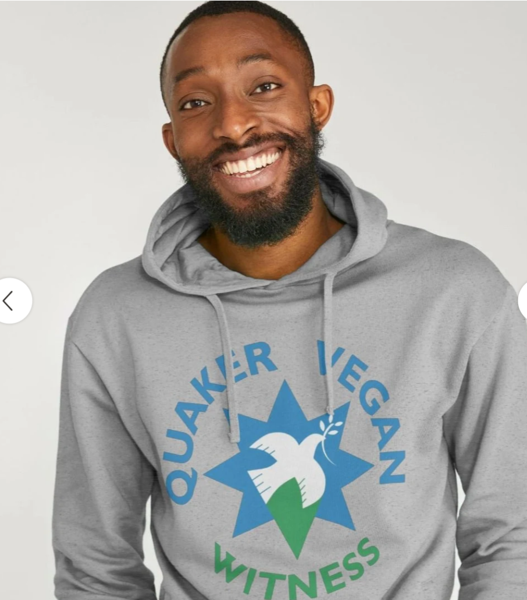

Hallo liebe Freunde und Freunde der Freunde!

Kommenden Samstag, den 18.10.2025 um 16 Uhr, findet in der Königstraße 132 in 47798 Krefeld die nächste Quäker-Andacht statt, zu der Ihr wieder herzlich eingeladen seid.

Für diejenigen, die möchten, besteht im Anschluss ab 17 Uhr die Möglichkeit, sich mit der Bibel zu beschäftigen, Glaubensfragen zu diskutieren und/oder einfach nur Tee zu trinken.

Für diesmal habe ich mir das Thema Veganismus vorgenommen.

- [Ein Blick in die Bibel](#ein-blick-in-die-bibel)
  - [Tiere und Sündenfall](#tiere-und-sündenfall)
- [Die Sintflut](#die-sintflut)
- [Tiere als Propheten](#tiere-als-propheten)
- [Veganismus als Sehnsucht nach Reinheit](#veganismus-als-sehnsucht-nach-reinheit)
- [Die _Planetary Health Diet_](#die-planetary-health-diet)
- [Veganismus und Quäkertum](#veganismus-und-quäkertum)
- [Weiterführendes](#weiterführendes)

## Ein Blick in die Bibel

Ich starte mit einem Blick in die Bibel. Da hatte ich schon seid längeren ein Paar Gedanken, wenn es um die tiere ging.

### Tiere und Sündenfall

Was vielleicht nicht allen bewusst ist, weil es nicht ausdrücklich gesagt wird, aber am Anfang waren alle Veganer. 1.Mose 1,29+30:

> 29 Dann sagte er: »Seht, als Nahrung gebe ich euch alle Pflanzen, die Samen tragen, und die Früchte, die überall an den Bäumen wachsen; 30 aber die Vögel und Landtiere sollen Gras und Blätter fressen.« Und so geschah es.

Also das paradiesische Leben ist ein veganes Leben gewesen! Deshalb kann ich mir das Himmlische Jerusalem als Vereisung auch nur vegan vorstellen. Also gerade nicht mit gebraten Tauben die einem in den Mund fliegen.

Bei dem Sünden Fall, haben die Tiere nichts falsches getan und trotzdem wurden sie aus dem Paradies, mit den Menschen zusammen, verstossen und erdulden seid auch dem den endlose Kreislauf aus fressen und gefressen werden. Eigentlich müsste und das unverschuldete Schicksal der Tiere eigentlich beschämen. Stattdessen sorgt unsere Eitelkeit nur darfür, das wir uns für unsere Nacktheit schämen.

## Die Sintflut

Nach der Vertreibung aus dem Paradies war es vermutlich so vorzustellen, das die Tiere sich untereinander auffrassen aber nicht von den Menschen gegessen wurden. Das änderte sich erst nach der Sintflut, als es kein Gemüse, Obst und Getreide mer gab, war es Menschen gestatte Fleisch zu essen. 1.Mose 9,3:

> Von jetzt an könnt ihr euch von ihrem Fleisch ernähren, nicht nur von den Pflanzen, die ich euch als Nahrung zugewiesen habe.

Die Sintflut ist jetzt schon eine ganze weile her und wir haben wieder jede menge vegane Alternativen (wenn wir mal die Eskimos außen vor lassen). Da hab ich dann schon gefragt: wie lange soll das Fleischessen noch weiter gehen? Wieder typisch Mensch: Man strekt ihm den kleinen Finger hin und er reist einem gleich wieder die ganze Hand ab.

Gut, die Tier-Opfer ergeben gar kein Sinn mehr, wenn man Veganer wäre. Zum Glück haben wir schon abgeschafft, auch ohne wieder zur veganen Ernährung zurück zu kehren.

## Tiere als Propheten

Tiere sind in der Bibel nicht nur dekorative Beigabe! Sie Teil der Heilsgeschichte!

- Bileam wird durch eine sprechende Eselin gerettet. 4.Mose 22,21–35
- Die Taube bei Noah. 1.Mose 8,8–12
- Der große Fisch bei Jona, als Symbol für Transformation und Neuanfang. Jona 1,17–2,10

## Veganismus als Sehnsucht nach Reinheit

In den verschiedensten Kulturen verbanden sich mit dem Essensregeln auch bestimmte Vorstellungen von Reinheit. Ob das der Buddhismus ist, der Hinduismus, der Islam, oder auch das Judentum und das Christentum. Überall gab es ein Bedürfnis sich von etwas Reinigen zu wollen oder zu müssen. Und es war eine Heilerwartung damit verbunden.

Jesus weist aber zurecht darauf hin, das Fasten und Essensregeln nicht zum selbstzweck oer ersatzhandlung werden dürfen. Matthäus 15,11:

> Nicht was ein Mensch zu sich nimmt, macht ihn vor Gott unrein, sondern das, was er von sich gibt.

Ich würde aber ergänzen: Nicht das was man ansich zu sich nimmt macht einem Menschen unrein, sondern das warum man etwas zu sich nimmt. Esse ich Fleisch aus gedanktenloser Genusssucht und vernichte damit Ressourcen, die dann anderen Menschen und Tiere fehlt? Buddhistischen Mönchen ist es sogar verboten, bereits satte Menschen zum weiter essen aufzufordern.

Paulus ergänzt in Römer 14,21 noch:

> Zwar sind in Gottes Augen alle Speisen rein. Manche Christen aber nehmen Anstoß daran, wenn du bestimmte Speisen isst. Das wäre schlimm. 21 Deswegen isst du besser kein Fleisch, trinkst keinen Wein und vermeidest überhaupt alles, was einen anderen Christen zu Fall bringt.

Ich denke das ist ein interessanter Gedanke und man könnte überlegen, was das für die heutige zeit bedeutet.

## Die _Planetary Health Diet_

Im Potcast ["Mehr als eine Vurst-Debatte" von Deutschlandfunk Nova](https://www.deutschlandfunknova.de/beitrag/ernaehrung-mehr-als-eine-vurst-debatte) wird in Minute 6:48 gesagt:

> Ja, es geht darum, wie wir uns ernähren und wie Lebensmittel weltweit produziert werden, also um das Ernährungssystem. Und das ist eine wirklich große Studie, da haben ungefähr 80 Forschende aus der ganzen Welt dran mitgearbeitet, erschienen ist die in The Lancet, einem renommierten medizinischen Fachblatt, und es gibt eine Aussage, die ist mir echt entgegengesprungen in dieser Studie, da steht, selbst wenn die ganze Welt jetzt aufhört, fossile Brennstoffe zu verfeuern, also kein Öl, kein Gas, kein Benzin mehr, das. Selbst dann würden wir die 1,5 Grad Marke noch reißen wegen unserer Ernährung.
> [...] in der Studie steht die Produktion von Lebensmitteln ist weltweit für ein Drittel aller Treibhausgase verantwortlich, und das hat zu tun mit der Fleischproduktion, aber auch damit, dass Wälder abgeholzt werden, um auf der Fläche Nutzpflanzen oder Tierfutter anzubauen, wie Getreide, Sojabohnen oder auch Ölpalmen.

Das sind sicher nicht die Dimensionen an die Jesus und Paulus dachte, aber es sind die Dimensionen an die wir denken sollten. Ich spreche selten ein Tischgebet (mit). Aber es mach wahrscheinlich Sinn, den Moment des Innehaltens, dafür zu nutzen inne zu halten und sich zu fragen, ob das sinnvoll ist, was ich da esse. Müssten wir uns nicht bedanken, sondern viel mehr darum bitten, das uns die Kraft zu geben, auf das zu verzichten, was für unsere erde eine Überlastung darstellt?

## Veganismus und Quäkertum

der Quäker [Benjamin Lay](https://de.wikipedia.org/wiki/Benjamin_Lay) (1682-1759) ass kein Fleisch, war aber vorallem bekannt als radikaler Abolitionist der gegen die Sklaverei auch und gerade unter Quäker kämpfte. Er wurde mehrmals während der Gottesdienste unsanft raugeworfen.

Im friendsjournal gibt es einen Artikel ["Vegetarianism in Quaker History"](https://www.friendsjournal.org/vegetarian-history/) von 2019, der die Geschichte der Vegetarier unter den Quäkern beleuchtet.

Im [Viktorianischen England waren einige Quäker aktivistische Vegetarier](https://ivu.org/history/thesis/quakers.html) die 1847 an der Gründung der _Vegetarian Society of England_ beteiligt waren.

Gibt es ein "Quaker Vegan Witness"? Also ein Veganes-Quäker-Zeugnis? Oder ist es schon beinhaltet/abgedeckt durch eines der schon vertretenen? Vielleicht ist es schon abgedeckt mit dem "Zeugnis der Gleichheit"? Oder dem "Zeugnis der Einfachheit"? Oder im Friedenszeugnis?

Nicht wenige Quäker beantworten die Frage mit "Ja" und vernetzen sich auf https://qvw.org.uk/.

Wie sieht es in Deutschland aus?

In den 1920ern gab es personellen Überschneidungen zwischen der [Lebensreform-Bewegung](https://de.wikipedia.org/wiki/Lebensreform) und Quäkern die sich durch eine gemeinsame Ausrichtung auf einen einfachen Lebensstil auszeichnete, zu dem auch Vegetarismus, Alkohol- und Tabakverzicht sowie einfache Kleidung gehörten.

Ich selber kenne einige Quäker, die vegan oder vegetarisch leben. Das und der Verzicht auf Alkohol und Zigaretten, ist wohl auch ein Grund, warum viele Quäker sehr alt werden.

## Weiterführendes

Ein weiterer Podcast-Hör-Tipp ist: Deutschlandfunk, aus der Reihe: ["Der rest ist Geschichte", "Vegetarismus - kein Blut auf dem Teller"](https://www.ardaudiothek.de/episode/urn:ard:episode:909a7c76083b102e/) beleuchtet das Thema noch mal geschichtlich.

---

This work is licensed under <a href="https://creativecommons.org/licenses/by/4.0/?ref=chooser-v1" target="\_blank" rel="license noopener noreferrer" style="display:inline-block;">CC BY 4.0</a>

---
