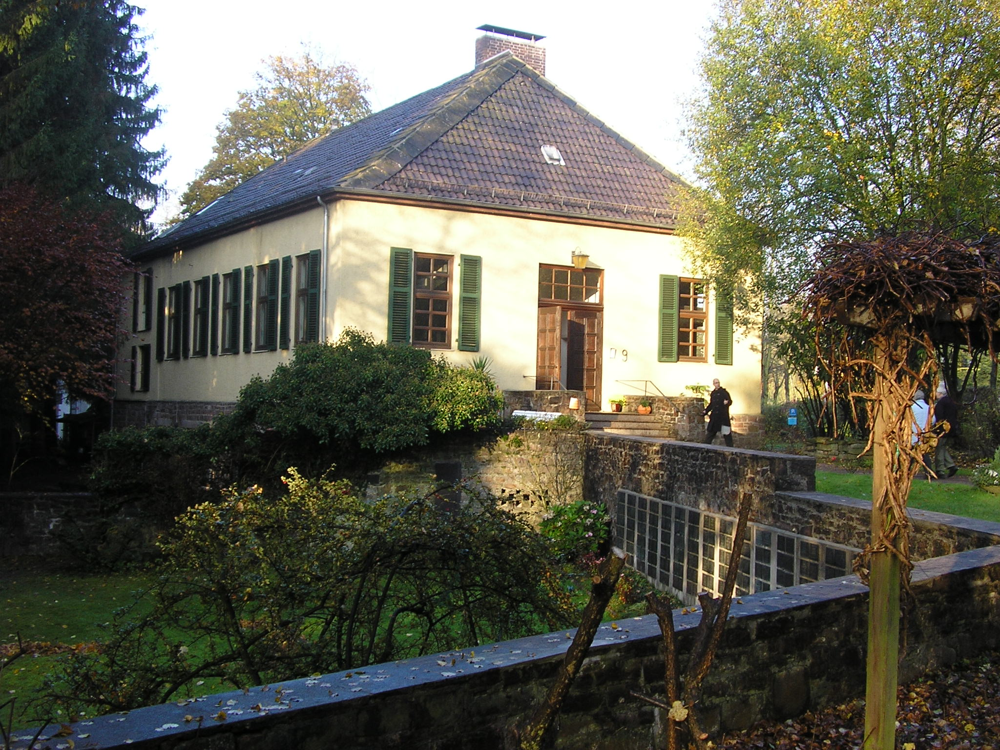
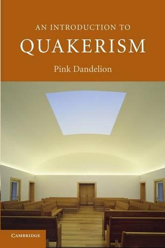

Hallo liebe Freunde und Freunde der Freunde!

Kommenden Samstag, den 4.4.2026 um 16 Uhr, findet in der Königstraße 132 in 47798 Krefeld die nächste Quäker-Andacht statt, zu der Ihr wieder herzlich eingeladen seid.

Für alle, die möchten, gibt es im Anschluss ab 17 Uhr die Möglichkeit, sich mit der Bibel zu beschäftigen, Glaubensfragen zu diskutieren oder einfach nur Tee zu trinken.

Diesmal ist das vorbereitete Thema: "Quäkertum und sakrale Architektur"

## Begrifflichkeit

### Kurzdefinition

> Sakralbauten (von lateinisch sacer ‚heilig‘) sind Bauwerke, die für sakrale, rituelle oder kultische Handlungen wie Gottesdienste oder Opferungen durch religiöse Gemeinschaften genutzt werden. (Wikipedia)

Sakralbauten im Kontext von Quäkertum werden nicht als **_"Kirchen"_** bezeichnet, sondern als Meeting Houses oder Versammlungshäuser. Das Wort **_"sakral"_** werden die meisten Quäker als unangebracht empfinden, da theologisch das Konzept abgelehnt wird, dass Orte, Gegenstände oder Handlungen **_"sakral"_** sind und andere Dinge nicht. Es wird vielmehr bei allem die innere Geisteshaltung betont.

Liberale Quäker argumentieren meist, dass alles heilig sei, da alles von Gott sei.

Christozentrische Quäker werden eher auf Bibelstellen wie diese verweisen (Johannes 4,21-24):

> Jesus antwortete: "Glaub mir, die Zeit kommt, in der ihr Gott, den Vater, weder auf diesem Berg noch in Jerusalem anbeten werdet. Ihr wisst ja nicht einmal, wer der ist, den ihr anbetet. Wir aber wissen, zu wem wir beten. Denn das Heil der Welt kommt von den Juden. Doch es kommt die Zeit – ja, sie ist schon da –, in der die Menschen den Vater überall anbeten werden, weil sie von seinem Geist und seiner Wahrheit erfüllt sind. Von solchen Menschen will der Vater angebetet werden. Denn Gott ist Geist. Und wer Gott anbeten will, muss von seinem Geist erfüllt sein und in seiner Wahrheit leben."

## Typische Merkmale von Quäker-Architektur

- Rechteckige, schlichte Baukörper
- Schlichte, funktionale Materialien: Holz oder Backstein, je nach Region
- Große Fenster für natürliches Licht (keine Glasmalerei)
- Ein einziger, offener Raum
- Sitzbänke, oft im Quadrat oder Kreis angeordnet
- Keine religiösen Symbole
- Manchmal zwei Eingänge (historisch für Männer und Frauen)

Quäker-Gebäude sind ein _Gegenentwurf_ zu fast allem, was Sakralarchitektur sonst ausmacht:

- Keine Transzendenz durch Höhe
- Keine symbolische Raumachse
- Keine liturgische Dramaturgie
- Keine Bildprogramme
- Keine sakralen Materialien

## George Fox und die „Turmhäuser“

George Fox, einer der Gründerfiguren der Quäkerbewegung, war für seine direkte, manchmal scharfzüngige Kritik an kirchlichen Institutionen bekannt. Wenn er die Kirchen anderer Konfessionen als „steeple-houses“ (Turmhäuser) verspottete, war das mehr als nur Polemik.

Was wollte er damit zum Ausdruck bringen?

- Fox wollte die Trennung zwischen heilig und profan aufheben.
- Ein Gebäude mit Turm, Altar und liturgischem Prunk erschien ihm als künstliche Distanzierung vom Göttlichen.
- Der Begriff „Turmhaus“ reduziert die Kirche auf ein banales Bauwerk — ein bewusster rhetorischer Trick.
- Für Fox war der wahre Gottesdienst nicht ortsgebunden, sondern fand im Inneren jedes Menschen statt.

Damit wird klar: Die frühe quäkerische Architekturverweigerung war ein theologisches Statement.

## Beispiele für Quäker-Architektur

### Arch Street Meeting House

- Ort: Philadelphia
- Erbaut: 1804
- Merkmal: Großes und altes Versammlungshaus in klassisch-quäkerischer Schlichtheit
- Bildquelle: [commons.wikimedia.org](https://commons.wikimedia.org/wiki/File:Arch_Street_Meetinghouse_from_front.jpg)

### Friends Meeting House

- Ort: Jordans (UK)
- Erbaut: 1688
- Merkmal: Eines der ältesten weltweit; typisch englischer Backsteinbau
- Bildquelle: [commons.wikimedia.org](https://commons.wikimedia.org/wiki/File:Friends%27_Meeting_House,_Jordans_-_geograph.org.uk_-_6121419.jpg)

### Friends House London

- Ort: London
- Erbaut: 1927
- Merkmal: Modernerer, funktionaler Bau mit auffälligem Portal und heute Konferenzzentrum
- Bildquelle: [/commons.wikimedia.org](https://commons.wikimedia.org/wiki/File:Euston_Road_area_26.jpg)

### Germantown Meeting House (USA)

- Ort: Germantown, USA
- Erbaut: 1770
- Merkmal: Beispiel für frühe amerikanische Quäkerarchitektur. Viele Meeting Houses haben bewegliche Trennwände, weil früher administrative Männer- und Frauenversammlungen parallel stattfanden. Das ist ein frühes Beispiel für flexible Raumgestaltung.
- Bildquelle: [commons.wikimedia.org](https://commons.wikimedia.org/wiki/File:Plymouth_Friends_Meeting_House,_Corner_of_Germantown_and_Butler_Pikes,_Plymouth_Meeting,_Montgomery_County,_PA_HABS_PA-6689-11.tif)

### _Quäkerhaus Bad Pyrmont_

- Ort: Bad Pyrmont, Deutschland
- Erbaut: ursprünglich 1800, Wiederaufbau 1932
- Merkmal: Der Bau ist aus England finanziert worden. Der dazugehörige Friedhof (unten links im Bild) ist noch älter.
- Bildquelle: [commons.wikimedia.org](https://commons.wikimedia.org/wiki/File:BadPyrmont-QH1_2008-10-31.jpg)

## James Turrell

James Turrell ist einer der bedeutendsten Lichtkünstler der Gegenwart. Er ist aufgewachsen in einer Quäkerfamilie. Seine Installationen arbeiten mit Stille, Wahrnehmung, Licht und innerer Erfahrung.

Er gestaltete auch einen Quäker-Meetingraum: das [Live Oak Friends Meeting House in Houston, Texas](https://houstonquakerskyspace.com/). Dort öffnet sich im Dach ein „Skyspace“: Ein quadratischer Ausschnitt, durch den der Himmel wie ein reines Farbfeld wirkt. Das ist im Grunde quäkerische Spiritualität in architektonischer Form: kein Symbol, kein Bild, nur Licht und Wahrnehmung. Das Meeting House ist auf dem Cover des Buches [_An Introduction to Quakerism_, Pink Dandelion](https://uk.bookshop.org/p/books/an-introduction-to-quakerism-pink-dandelion/3952779?ean=9780521600880&next=t) zu sehen.

---

This work is licensed under <a href="https://creativecommons.org/licenses/by/4.0/?ref=chooser-v1" target="\_blank" rel="license noopener noreferrer" style="display:inline-block;">CC BY 4.0</a>

