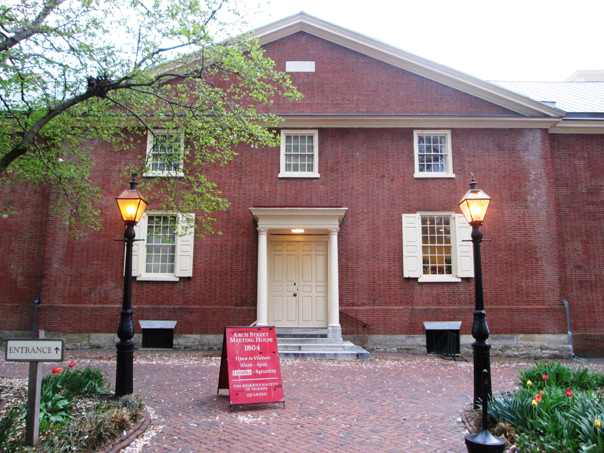
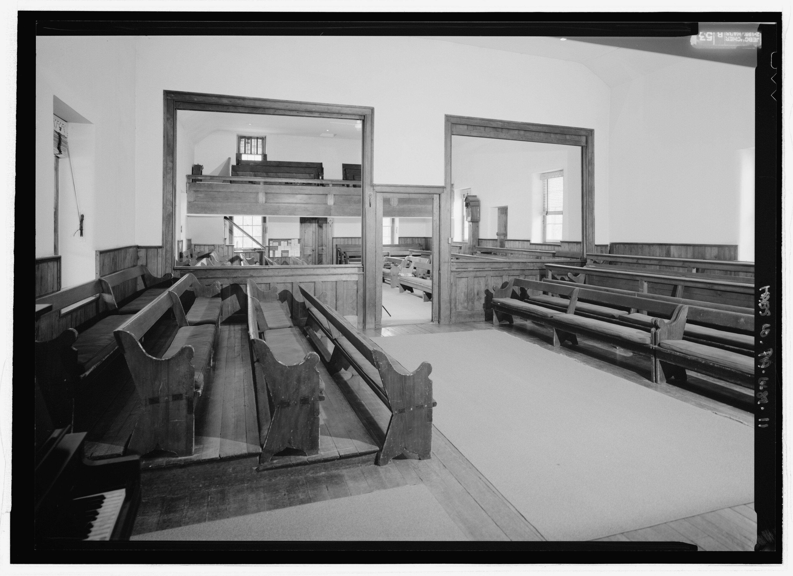

Quäker sprechen nicht von „Kirchen“, sondern von Meeting Houses.

### Typische Merkmale:

- Rechteckige, schlichte Baukörper
- Holz oder Backstein, je nach Region
- Große Fenster für natürliches Licht
- Ein einziger, offener Raum
- Sitzbänke, oft im Quadrat oder Kreis angeordnet
- Keine religiösen Symbole
- Manchmal zwei Eingänge (historisch für Männer und Frauen)

Quäker-Gebäude sind ein _Gegenentwurf_ zu fast allem, was Sakralarchitektur sonst ausmacht:

- Keine Transzendenz durch Höhe
- Keine symbolische Raumachse
- Keine liturgische Dramaturgie
- Keine Bildprogramme
- Keine sakralen Materialien

### George Fox und die „Turmhäuser“

George Fox, der Gründer der Quäkerbewegung, war für seine direkte, manchmal scharfzüngige Kritik an kirchlichen Institutionen bekannt. Wenn er die Kirchen anderer Konfessionen als „steeple-houses“ (Turmhäuser) verspottete, war das mehr als nur Polemik.
💡 Was steckt dahinter?

- Fox wollte die Trennung zwischen heilig und profan aufheben.
- Ein Gebäude mit Turm, Altar und liturgischem Prunk erschien ihm als künstliche Distanzierung vom Göttlichen.
- Der Begriff „Turmhaus“ reduziert die Kirche auf ein banales Bauwerk — ein bewusster rhetorischer Trick.
- Für Fox war der wahre Gottesdienst nicht ortsgebunden, sondern fand im Inneren jedes Menschen statt.

Damit wird klar: Die frühe quäkerische Architekturverweigerung war ein theologisches Statement.

### Beispiele

#### Arch Street Meeting House

- Ort: Philadelphia
- Erbaut: 1804
- Merkmal: Eines der größten und ältesten; klassisch-quäkerische Schlichtheit
- Bildquelle: [commons.wikimedia.org](https://commons.wikimedia.org/wiki/File:Arch_Street_Meetinghouse_from_front.jpg)

#### Friends Meeting House

- Ort: Jordans (UK)
- Erbaut: 1688
- Merkmal: Eines der ältesten weltweit; typisch englischer Backsteinbau
- Bildquelle: []commons.wikimedia.org(https://commons.wikimedia.org/wiki/File:Friends%27_Meeting_House,_Jordans_-_geograph.org.uk_-_6121419.jpg)

#### Friends House London

- Ort: London
- Erbaut: 1927
- Merkmal: Moderner, funktionaler Bau; heute Konferenzzentrum
- Bildquelle: [/commons.wikimedia.org](https://commons.wikimedia.org/wiki/File:Euston_Road_area_26.jpg)

#### Germantown Meeting House (USA)

Ein schönes Detail:

- Ort: Germantown, USA
- Erbaut: 1770
- Merkmal: Beispiel für frühe amerikanische Quäkerarchitektur. Viele Meeting Houses haben bewegliche Trennwände, weil früher Männer- und Frauenversammlungen parallel stattfanden. Das ist ein frühes Beispiel für flexible Raumgestaltung.
- Bildquelle: [commons.wikimedia.org](https://commons.wikimedia.org/wiki/File:Plymouth_Friends_Meeting_House,_Corner_of_Germantown_and_Butler_Pikes,_Plymouth_Meeting,_Montgomery_County,_PA_HABS_PA-6689-11.tif)

### James Turrell

James Turrell ist Einer der bedeutendsten Lichtkünstler der Gegenwart. Er ist aufgewachsen in einer Quäkerfamilie. Seine Installationen arbeiten mit Stille, Wahrnehmung, Licht und innerer Erfahrung.

Er gestaltete auch einen Quäker-Meetingraum. Das [Live Oak Friends Meeting House in Houston, Texas](https://houstonquakerskyspace.com/). Dort öffnet sich im Dach ein „Skyspace“: Ein quadratischer Ausschnitt, durch den der Himmel wie ein reines Farbfeld wirkt. Das ist im Grunde quäkerische Spiritualität in architektonischer Form: kein Symbol, kein Bild, nur Licht und Wahrnehmung.
