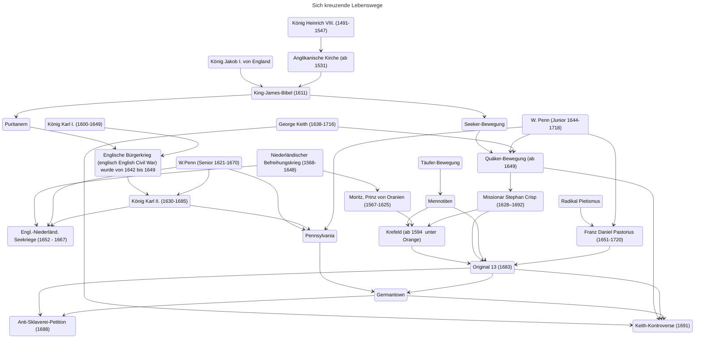

Hallo liebe Freunde und Freunde der Freunde!

Kommenden Samstag, den 18.10.2025 um 16 Uhr, findet in der Königstraße 132 in 47798 Krefeld die nächste Quäker-Andacht statt, zu der Ihr wieder herzlich eingeladen seid.

Für diejenigen, die möchten, besteht im Anschluss ab 17 Uhr die Möglichkeit, sich mit der Bibel zu beschäftigen, Glaubensfragen zu diskutieren und/oder einfach nur Tee zu trinken.

